# Decision Tree And Capability Comparison

Use this reference when comparing multiple viable interfaces, explaining a
route, or checking that a proposed route covers every decision branch. The
capability decision comes before the product adapter: first decide what kind of
surface is required, then discover which current tool provides it.

## Complete Decision Tree

```mermaid
flowchart TD
  A[Interaction requested] --> B{Explicit interface constraint?}
  B -->|Yes| C[Preserve it as a constraint]
  B -->|No| D[No interface constraint]
  C --> E
  D --> E

  E{An interface eligible under the constraint is a<br/>connector, API, or repository CLI that fully supports<br/>operation, authentication, and readback?}
  E -->|Yes| F[Use semantic interface<br/><small>route: connector-api-cli</small>]
  E -->|No| G{Target surface?}

  G -->|Web-page DOM| HX{Needs both current daily-browser state<br/>and isolation or concurrency?}
  HX -->|Yes| RC[Report incompatible requirements<br/><small>route: report-requirement-conflict</small>]
  HX -->|No| HC{Explicitly constrained to a<br/>shared-state DOM integration?}
  HC -->|Yes| H0
  HC -->|No| H{Needs current browser state?}
  G -->|Browser chrome or native dialog| N0
  G -->|Native app or OS UI| N0
  G -->|Unclassified or no semantic surface| U0

  H -->|Tabs, login, SSO, passkey, extension,<br/>handoff, or actual browser behavior| H0{Shared-state DOM integration<br/>available and eligible?}
  H0 -->|Yes| H1{Required session state present?}
  H0 -->|No| U0
  H1 -->|Yes| I[Use verified shared-state DOM integration<br/><small>route: verified-shared-state-dom</small>]
  H1 -->|No| IH[Hand the page to the user for authentication<br/>in the required browser, then verify the session]
  IH --> H2{Required session state established?}
  H2 -->|Yes| I
  H2 -->|No| BL
  H -->|No| J{Needs isolation, concurrency,<br/>repeatability, headless execution,<br/>or managed identity?}
  J -->|Yes| JT{Requires Tier C lifecycle or<br/>high-fidelity file capture?}
  JT -->|Yes| M0
  JT -->|No| J0{Managed agent-browser available, eligible,<br/>and carrying any required managed session?}
  J0 -->|Yes| K[Use agent-browser with dedicated or managed profile<br/><small>route: managed-agent-browser</small>]
  J0 -->|No| J1{Managed Playwright route available, eligible,<br/>and carrying any required managed session?}
  J1 -->|Yes| L3
  J1 -->|No| JA0{Managed identity required and an eligible<br/>agent-browser route can host authentication?}
  JA0 -->|Yes| K
  JA0 -->|No| JA1{Managed identity required and an eligible<br/>Playwright route can host authentication?}
  JA1 -->|Yes| L3
  JA1 -->|No| U0
  J -->|No| JF{Output requires small-text fidelity or<br/>more than the in-app pane's 800 px ceiling?}
  JF -->|Yes| M0
  JF -->|No| LA{In-app DOM browser available<br/>and eligible under the constraint?}
  LA -->|Yes| L[Use in-app DOM browser<br/><small>route: in-app-dom-browser</small>]
  LA -->|No| LF{Requires Tier C lifecycle or<br/>high-fidelity file capture?}
  LF -->|Yes| M0
  LF -->|No| LB{Managed agent-browser<br/>available and eligible?}
  LB -->|Yes| K
  LB -->|No| L4{Playwright route<br/>available and eligible?}
  L4 -->|Yes| L3
  L4 -->|No| U0

  L --> SP{Requires a startup-only focus<br/>or visibility check?}
  SP -->|Yes| P0{Eligible pre-navigation injection available<br/>and navigation can be restarted safely?}
  P0 -->|Yes| P1[Install the override before navigation, then navigate<br/><small>route: in-app-pre-navigation-shim</small>]
  P1 --> RD
  P0 -->|No| M0
  SP -->|No| M{Requires animation, video, canvas, transition,<br/>or another real lifecycle?}
  M -->|Yes: Tier C| M0
  M0{Playwright or background Chromium available,<br/>eligible, and carrying any required managed session?}
  M0 -->|Yes| L3[Use Playwright or background Chromium<br/><small>route: playwright-or-background-chromium</small>]
  M0 -->|No| TC{Managed agent-browser available, eligible,<br/>and carrying any required managed session?}
  TC -->|Yes| K
  TC -->|No| MA{Managed identity required and an eligible<br/>Playwright route can host authentication?}
  MA -->|Yes| L3
  MA -->|No| MA2{Managed identity required and an eligible<br/>agent-browser route can host authentication?}
  MA2 -->|Yes| K
  MA2 -->|No| U0
  M -->|No| LP{Page readiness predicate satisfied?}
  LP -->|Yes| A1
  LP -->|No| M1{Requires a focus or visibility handler<br/>without real-frame semantics?}
  M1 -->|Yes: Tier B| B0{JavaScript injection available<br/>and eligible?}
  B0 -->|Yes| L2[Install the post-navigation shim<br/><small>route: in-app-tier-b-shim</small>]
  B0 -->|No| M0
  M1 -->|No| M2{Frame-driven predicate is stalled?}
  M2 -->|Yes: Tier A| A0{Screenshot or compositor action<br/>available and eligible?}
  A0 -->|Yes| L1[Take one screenshot render pump<br/><small>route: in-app-tier-a-render-pump</small>]
  A0 -->|No| M0
  M2 -->|No: rAF already running| AB
  L1 --> IR{Page readiness predicate satisfied<br/>after the intervention?}
  L2 --> IR
  IR -->|Yes| A1
  IR -->|No| R0{Evidence requires real lifecycle and an available,<br/>eligible Tier C route has not run?}
  R0 -->|Yes| M0
  R0 -->|No| AB

  I --> RD{Page readiness predicate satisfied?}
  K --> MS{Route requires a signed-in<br/>managed identity?}
  L3 --> MS
  MS -->|No| RD
  MS -->|Yes| MS1{Required managed-profile<br/>session state present?}
  MS1 -->|Yes| RD
  MS1 -->|No| JH[Hand the managed-profile page to the user<br/>for authentication, then verify the session]
  JH --> MS2{Required managed-profile<br/>session state established?}
  MS2 -->|Yes| RD
  MS2 -->|No| BL
  RD -->|Yes| A1
  RD -->|No| R1{Evidence now requires real lifecycle and an available,<br/>eligible Tier C route has not run?}
  R1 -->|Yes| M0
  R1 -->|No| AB

  N0{Requires Peekaboo-specific macOS system,<br/>window, menu, Space, deep AX, or capture capability?}
  N0 -->|Yes| Q
  N0 -->|No| N{Host first-party computer use available,<br/>capable, and eligible?}
  N -->|Yes| O[Use first-party computer use<br/><small>route: host-first-party-computer-use</small>]
  N -->|No| P{Running as Codex?}
  P -->|Yes| Q
  P -->|No| R{Registered and healthy Codex CUA bridge<br/>provides the capability and is eligible?}
  R -->|Yes| S[Use Codex CUA bridge<br/><small>route: healthy-codex-cua-bridge</small>]
  R -->|No| RI{Compatible macOS host and upstream component present,<br/>and bridge eligible but unregistered or unhealthy?}
  RI -->|Yes| RA[Offer the registration or repair command<br/>and request authorization]
  RA --> RR{User authorized it and the bridge is now<br/>registered, healthy, capable, and eligible?}
  RR -->|Yes| S
  RR -->|No| Q
  RI -->|No| Q
  Q{Does available and eligible Peekaboo provide<br/>the required macOS capability?}
  Q -->|Yes| T[Use Peekaboo<br/><small>route: peekaboo</small>]
  Q -->|No| U0{Coordinate-capable acting surface available,<br/>eligible, and capable of all remaining requirements?}
  U0 -->|Yes| U[Use screenshot interpretation and coordinates<br/><small>route: screenshot-coordinates</small>]
  U0 -->|No| BL

  BL{Does an explicit interface constraint block<br/>an otherwise capable route?}
  BL -->|Yes| LC[Report interface-constraint conflict<br/><small>route: report-constraint-conflict</small>]
  BL -->|No| LU[Report capability unavailable<br/><small>route: report-capability-unavailable</small>]

  F --> A1[Act once]
  O --> A1
  S --> A1
  T --> A1
  U --> A1
  A1 --> V[Read back the intended predicate]
  V --> W{Predicate satisfied?}
  W -->|Yes| IV{Consequential action or acting interface<br/>reported an unverifiable effect?}
  IV -->|No| X[Complete]
  IV -->|Yes| IV1[Verify independently through a semantic<br/>or visual surface]
  IV1 --> IV2{Independent predicate satisfied?}
  IV2 -->|Yes| X
  IV2 -->|No| AB
  W -->|No| Y[Refresh current state once without acting]
  Y --> YP{Intended predicate satisfied after refresh?}
  YP -->|Yes| IV
  YP -->|No| Z{Evidence shows missing capability or context?}
  Z -->|No| AB[Report the unresolved result;<br/>continue readback only when safe and useful]
  Z -->|Yes| AA[Switch interface and reacquire every selector or identifier]
  AA --> E

```

The diagram expresses selection, not authorization. Preserve the user's current
authorization boundary at every leaf. When an explicit interface is present,
only routes compatible with it are eligible throughout the tree. The constraint
does not make an incapable interface capable; report the conflict when no safe
route satisfies both the constraint and the operation.

Startup-only focus or visibility checks first test whether an eligible override
can be installed before navigation. Otherwise, lifecycle checks are ordered
from strongest requirement to weakest: Tier C, then Tier B, then Tier A. A
later tier is considered only after the page is known not to require an earlier
one.

## Capability Comparison

| Capability | Best fit | Authentication and data boundary | Semantics and verification | Isolation | Foreground and contention | Principal limitation |
| --- | --- | --- | --- | --- | --- | --- |
| Connector, API, or repository CLI | Complete semantic operations | Usually the narrowest explicit scope | Strong typed or structured readback | High | None | Cannot complete UI-only steps |
| Shared-state DOM integration | Current tabs, login, SSO, passkeys, extensions, handoff, or actual browser behavior | Broad access to the user's daily browser | Strong page-DOM semantics | Low | May occupy the real browser | Shared state must be verified, not inferred from a product label |
| In-app DOM browser | Public, one-off background page work | Separate from the daily browser | Strong DOM access when its measured lifecycle is sufficient | Medium | None | Focus, animation, lazy loading, and screenshot fidelity can require escalation |
| agent-browser with a managed profile | Repeatable, concurrent, headless, worktree-scoped, or persistent signed-in automation | Dedicated profile with an explicit identity boundary | Strong DOM access and reproducibility | High | Usually none | Never attach it to the user's daily browser profile |
| Playwright or background Chromium | Real page lifecycle, animation, video, canvas, or transitions | Ephemeral or dedicated managed profile | Strong DOM and CDP readback | High | Can remain in the background | A real profile requires lock, port, process, and endpoint ownership checks |
| Host first-party computer use | Ordinary native application interaction | Integrated with the host's policy and session | Accessibility semantics with read-after-act verification | Low to medium | Implementation-dependent | Capability and tool inventory vary by host session |
| Codex Computer Use bridge | Native UI from a non-Codex harness lacking first-party computer use | The caller retains the authorization boundary | Compact accessibility tree and diff readback | Low to medium | Background-safe | macOS-only, requires registration and health verification, and adds latency |
| Peekaboo | macOS windows, menus, Dock, Spaces, dialogs, deep accessibility, capture, and troubleshooting | Operates on the live desktop | Broad accessibility and system-surface coverage | Low | Can contend with the user | State identifiers become stale; some background input can be an unverifiable no-op |
| Screenshot interpretation and coordinates | No usable semantic, DOM, or accessibility path | Inherits the acting surface's boundary | Weakest; requires visible readback after every consequential action | Low | Usually highest | Requires a verified coordinate-capable acting surface and remains fragile under layout or state changes |

## Representative Routes

| Requirement | Selected capability | Fallback |
| --- | --- | --- |
| Update an authenticated GitHub issue | Authenticated connector or `gh` when it supports the complete operation | Verified shared-state DOM integration |
| Inspect a page already signed in in the user's Chrome | Verified shared-state DOM integration | Hand the page to the user for authentication in that browser if the session is absent |
| Run signed-in checks in parallel worktrees | agent-browser with worktree-scoped managed profiles | Dedicated Playwright profiles |
| Read a public documentation page in the background | In-app DOM browser | agent-browser when lifecycle evidence requires it |
| Exercise canvas animation without taking the user's foreground | Playwright or background Chromium | A managed headed Chromium profile when extensions or persistent login are required |
| Operate a native app from Codex | Codex first-party Computer Use | Peekaboo for missing macOS-specific capability |
| Operate a native app from a harness without first-party computer use | Registered and healthy Codex Computer Use bridge | Peekaboo on macOS |
| Move a window, choose a menu, or inspect a system dialog | Peekaboo | Screenshot coordinates only when no accessibility path exists |

## Verification Contract

- Define the intended result as a semantic or visible predicate before acting.
- Treat action completion as dispatch evidence only; read the predicate afterward.
- After a failure, refresh the current interface once before changing routes.
- Switch only when the refreshed state demonstrates missing capability or
  context. Reacquire all DOM references, accessibility indexes, snapshot IDs,
  and coordinates after switching.
- Add an independent readback for consequential actions or when the acting
  interface reports an unverifiable effect.
